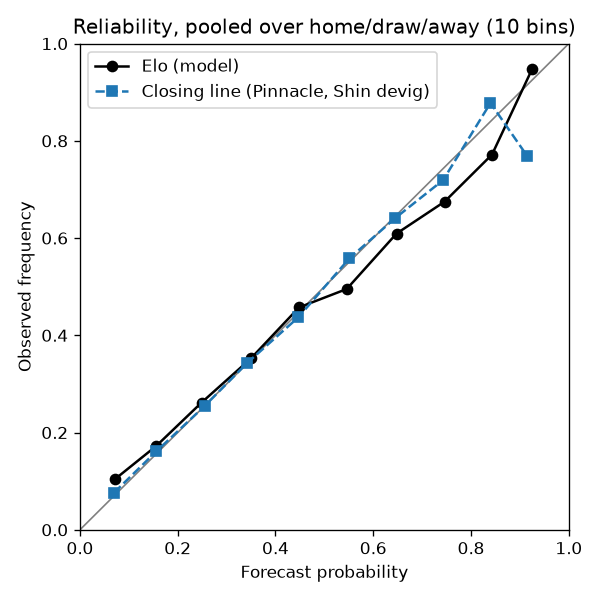
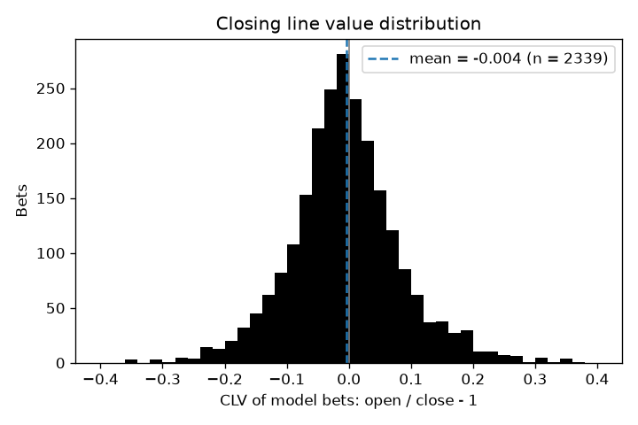
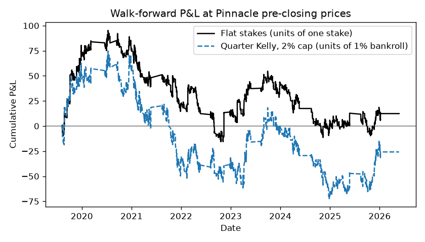
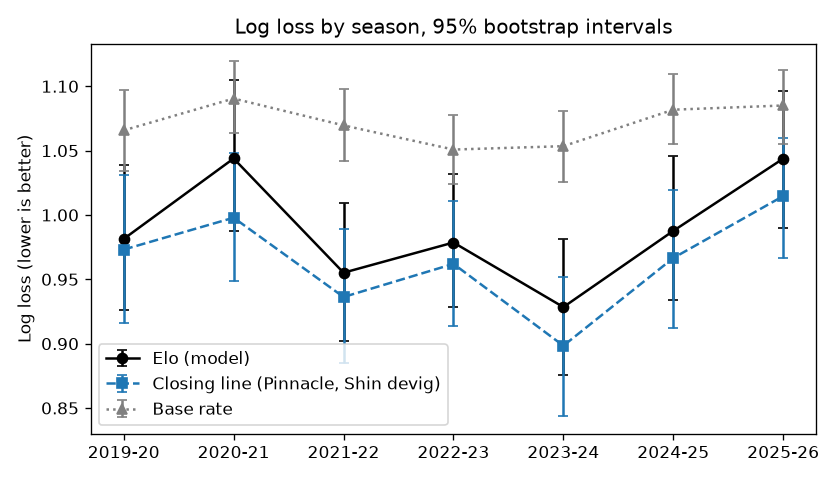

# closing-line

A measurement harness for probabilistic football forecasts, scored against the closing line. The benchmark is the Pinnacle closing 1X2 price with the overround removed. A model is only interesting if it beats that price, so every number here is comparative. The baseline model (Elo) is a control, not a contender, and it loses.

Paper-only. Nothing here places bets or talks to an exchange.

## 1. What this is

Modules in `src/`: `data.py` (download and tidy), `odds.py` (implied probabilities, devig, consensus, benchmark), `model.py` (Elo baseline behind a generic `fit` / `predict` interface), `evaluate.py` (proper scores, calibration, CLV, staking, bootstrap intervals), `backtest.py` (walk-forward). Scripts in `scripts/` write CSVs to `results/` and PNGs to `figs/`; nothing prints.

```bash
python scripts/run_backtest.py && python scripts/make_figures.py
```

## 2. Data and methodology

* **Source.** football-data.co.uk season CSVs, English Premier League (`E0`), downloaded once and cached under `data/raw/`.
* **Sample.** Ten seasons, 2016-17 to 2025-26, 3800 matches. The first three seasons are training only; the walk-forward evaluates 2660 matches from 2019-20 to 2025-26.
* **Book.** Pinnacle, the only book in the source with closing prices across all ten seasons and the lowest overround (mean 2.5% at close versus 4.7% to 5.8% elsewhere). Pinnacle prices stop on 17 January 2026; the last 170 matches use a consensus of the other books priced at close (six to seven of them) for scoring, and are not bet.
* **Closing line.** The source's `PSCH/PSCD/PSCA` columns, devigged with Shin's method. The "opening" price used for bets is the source's pre-closing snapshot, collected Friday afternoon for weekend matches and Tuesday afternoon for midweek ones. It is not a true opening line. CLV is therefore measured over a shorter window than open-to-close.
* **Devig.** Shin (1993) by default. It has a model behind it and sits between the multiplicative and additive answers. On Pinnacle closing prices the three methods differ by 0.1 to 0.5 probability points on average and up to 2.4 points at the extremes; the disagreement grows with favourite strength (`results/odds_devig_by_favourite.csv`). Log loss of the benchmark is statistically identical under all three.
* **Split.** Expanding window, one season at a time. For test season *i* the model's three hyperparameters are fitted on seasons 1 to *i* - 1, then it predicts season *i* in date order, updating ratings on each result after predicting it. No refitting on future data. A test asserts that altering later results leaves earlier predictions bit-identical.
* **Bets.** At most one per match: the outcome with the largest expected value at Pinnacle's pre-closing price, if positive. Settled at that price, vig included. Flat stakes of 1% of a constant bankroll, or quarter Kelly capped at 2%, no compounding.
* **Intervals.** 95% percentile bootstrap over matches, 2000 replicates, seed 0. Every script is deterministic and re-running reproduces the CSVs byte for byte.

## 3. Headline

2660 out-of-sample matches, 2019-20 to 2025-26. Lower is better for the first three columns.

| forecaster | log loss | Brier | ECE (pooled) |
|---|---|---|---|
| closing line | 0.964 [0.946, 0.983] | 0.572 [0.559, 0.585] | 0.005 |
| Elo | 0.988 [0.968, 1.009] | 0.589 [0.575, 0.603] | 0.021 |
| base rate | 1.071 [1.060, 1.082] | 0.649 [0.641, 0.656] | 0.015 |

Paired differences against the closing line on identical matches:

| comparison | log loss diff | Brier diff |
|---|---|---|
| Elo - close | +0.024 [+0.016, +0.032] | +0.017 [+0.012, +0.022] |
| base rate - close | +0.107 [+0.090, +0.123] | +0.077 [+0.065, +0.088] |

Elo loses to the closing line. The interval excludes zero. It recovers about three quarters of the gap between the base rate and the market.

Betting, 2339 model bets at Pinnacle pre-closing prices:

| metric | value | 95% CI | note |
|---|---|---|---|
| mean CLV (open / close - 1) | -0.4% | [-0.8%, 0.0%] | spans zero |
| mean EV at close | -3.9% | [-4.2%, -3.5%] | the closing line says these bets lose |
| ROI, flat stakes | +0.5% | [-6.7%, +8.0%] | spans zero |
| ROI, quarter Kelly | -0.8% | [-7.5%, +5.8%] | spans zero |

ECE intervals are biased upward: ECE is a sum of absolute deviations, so resampling noise only adds to it, and the point estimate for a well-calibrated forecaster can sit below its own interval. Use them to compare forecasters, not as coverage guarantees. Full tables: `results/backtest_*.csv`.

## 4. Calibration



_To fill in: what the reliability curve shows in the 0.5 to 0.8 range, per-outcome ECE (`ece_h`, `ece_d`, `ece_a`), and how much of Elo's loss to the market is calibration versus discrimination._

## 5. Closing line value





_To fill in: the shape of the CLV distribution, why EV-at-close is negative while CLV is near zero (the model bets 88% of matches, so it is mostly betting into the vig), and the season-by-season picture._

## 6. Limitations

* Single league, single sport, single model family.
* One book. No line-shopping; a bettor with several accounts sees better prices than these.
* The "opening" price is a Friday or Tuesday afternoon snapshot, not the true opener.
* No bet-size limits modelled, and no account closures. Pinnacle is unusual in accepting winners.
* Survivorship of books: the source's book list changes across seasons; the benchmark book was chosen for coverage, not at random.
* The last 170 matches of 2025-26 are scored against a consensus of soft books, not Pinnacle.
* Bootstrap intervals treat matches as independent. Same-round matches share weather, fixtures and news.
* ECE intervals are biased upward (see section 3).
* Number of model variants tried: one. No hyperparameter or feature search beyond the three-parameter fit per season.

## 7. Roadmap

* Dixon-Coles and bivariate Poisson behind the same `fit` / `predict` interface.
* Promotion handling and between-season regression to the mean for Elo.
* Add 2015-16 (Pinnacle prices exist) and a second league.
* Sensitivity of CLV to a minimum-edge threshold instead of betting every positive-EV side.
* A model that combines Elo with the pre-closing price, to test whether any information survives the market.
